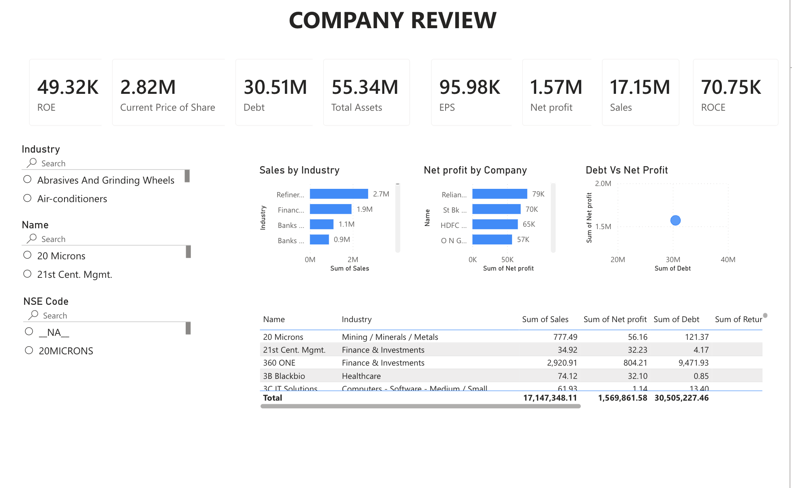
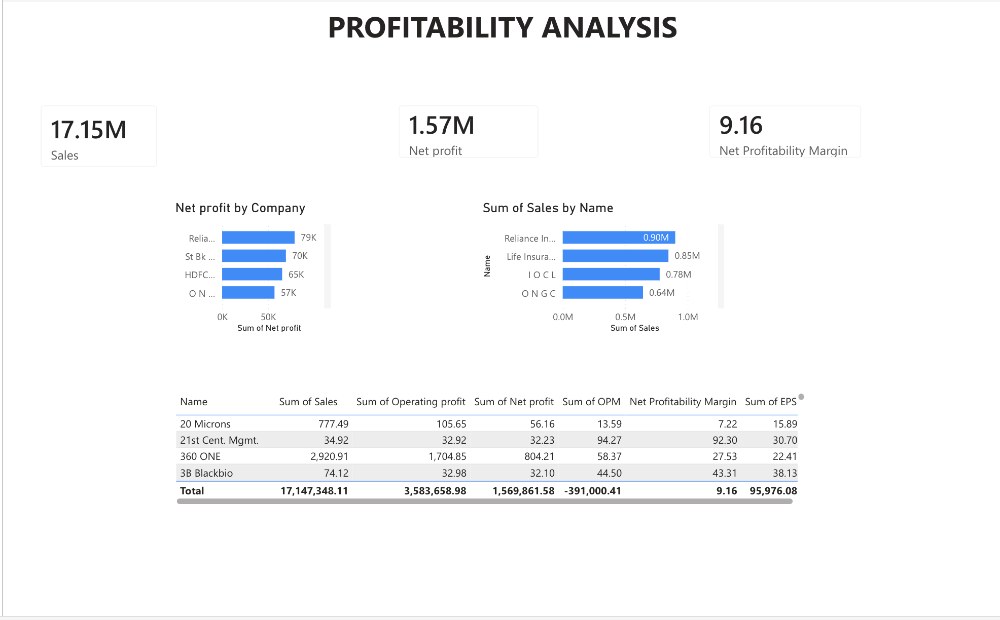
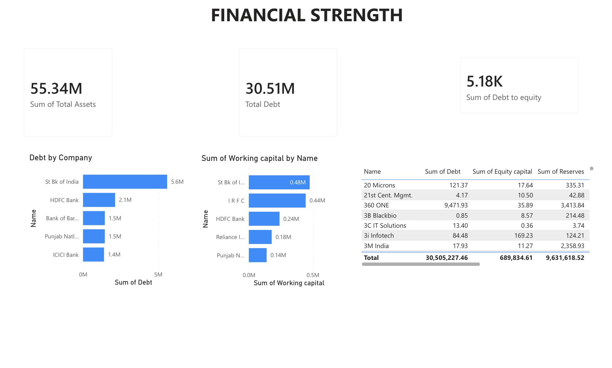
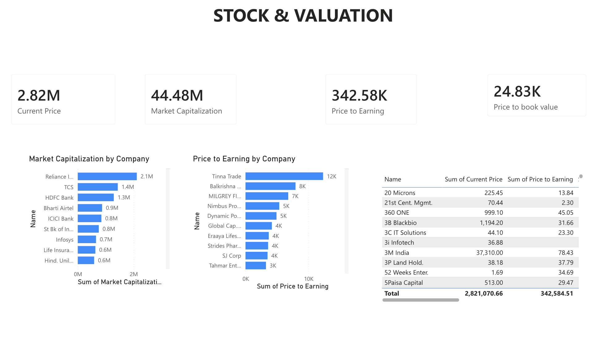

# 📊 Financial Statement Analysis Dashboard

## Overview

This project presents an interactive Financial Statement Analysis Dashboard developed using Microsoft Power BI.

The dashboard analyzes financial performance using Balance Sheet, Profit & Loss, Cash Flow, and Financial Ratio datasets.

It helps users evaluate profitability, liquidity, leverage, valuation, and cash flow performance across companies through interactive visualizations.

---

## Objectives

- Analyze company financial performance
- Compare profitability across industries
- Evaluate liquidity and solvency
- Study valuation metrics
- Analyze cash flow performance
- Create an interactive business intelligence dashboard

---

## Tools Used

- Microsoft Power BI
- Microsoft Excel
- Power Query
- DAX
- Data Modeling

---

## Dataset

The dashboard is built using:

- Balance Sheet
- Profit & Loss Statement
- Cash Flow Statement
- Financial Ratios

---

## Dashboard Pages

### Executive Dashboard

- Total Companies
- Total Revenue
- Total Net Profit
- Total Assets
- Total Liabilities
- Average ROE
- Average ROA

### Profitability Dashboard

- Revenue Analysis
- Net Profit Analysis
- ROE
- ROA
- EBITDA Margin

### Financial Position Dashboard

- Assets vs Liabilities
- Debt to Equity
- Current Ratio
- Working Capital

### Valuation Dashboard

- PE Ratio
- Price to Book
- EV/EBITDA
- Market Capitalization

---

## Skills Demonstrated

- Financial Statement Analysis
- Financial Ratio Analysis
- Data Cleaning
- Data Modeling
- DAX
- Power Query
- Dashboard Design
- Business Intelligence

---

## Dashboard Preview

### Executive Dashboard

### Profitability Dashboard

### Financial Position Dashboard

### Valuation Dashboard

---

## Author

**R. Brindha**

PGDM Finance & Human Resource

Loyola Institute of Business Administration (LIBA)

Chennai, India
